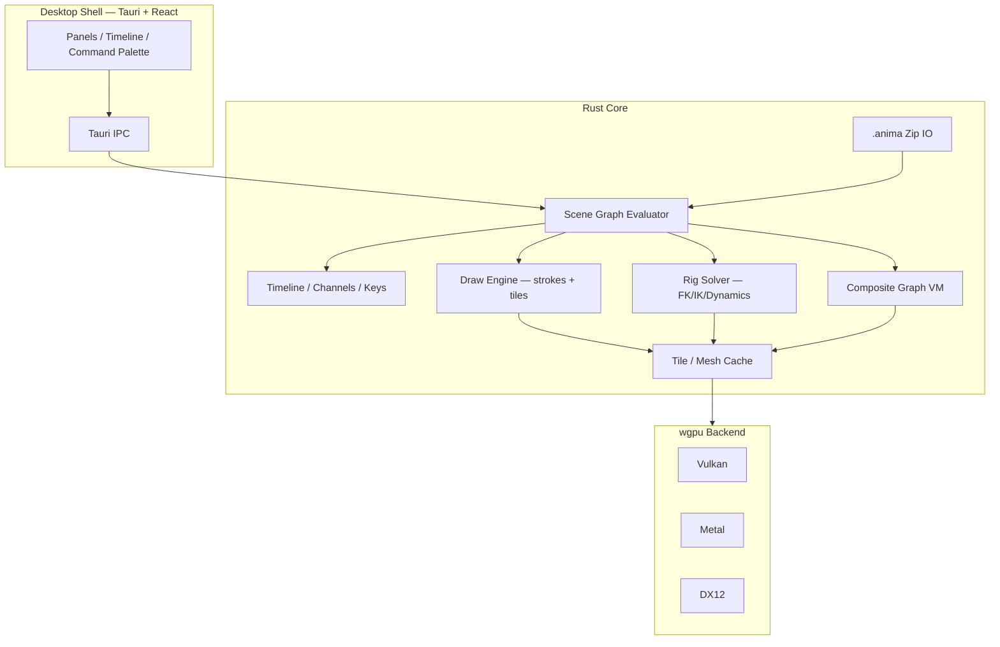
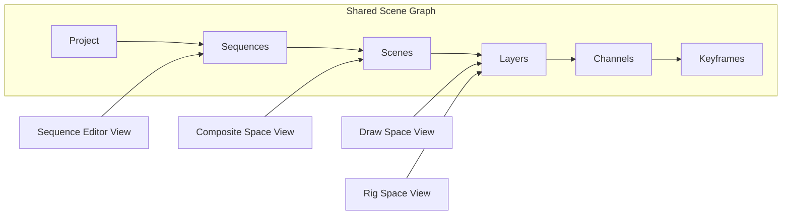
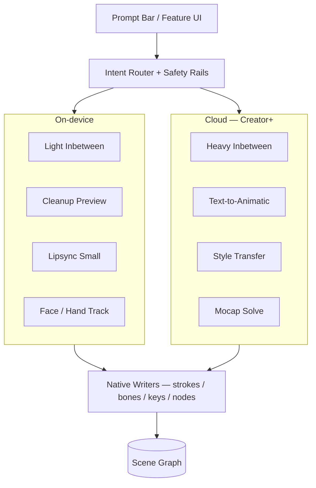
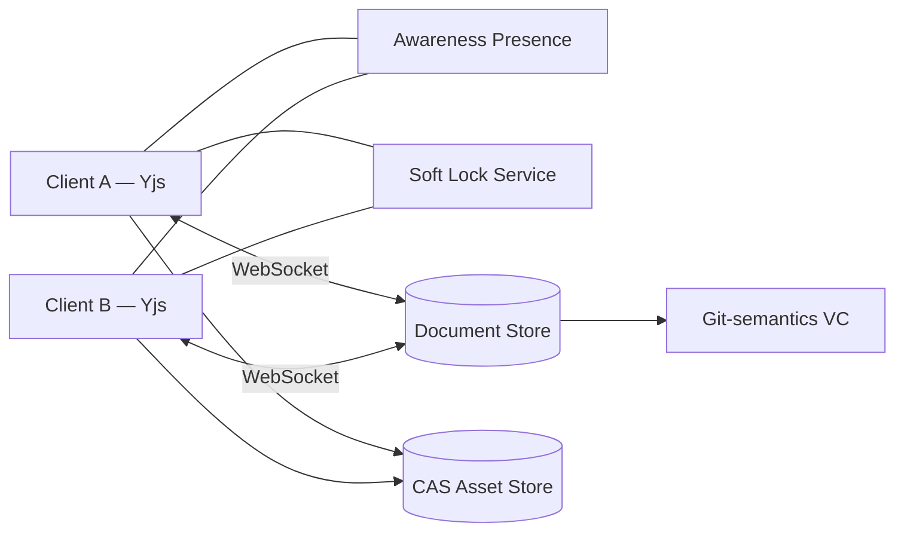
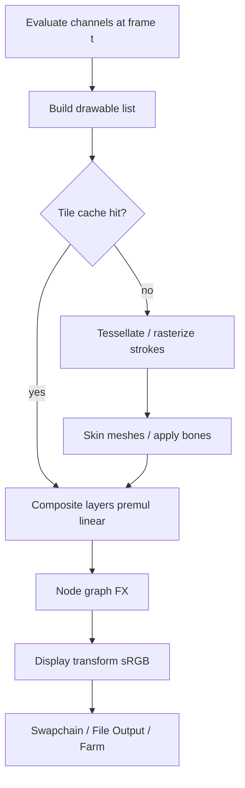

# ANIMA Architecture

Canonical stack: **Rust + wgpu core**, **Tauri 2 + React** desktop shell, **Python (PyO3)** scripting, **QuickJS** expressions, **Yjs** sync, **WASM** reduced web build.

## 1. Core engine

## 2. Three workspaces ↔ shared graph

Switching workspaces flushes buffers and rebinds tools; it does **not** bake layers.

## 3. AI services

**Hard rule:** AI never terminates in non-editable video as the deliverable artifact.

## 4. Sync server (Creator / Studio)

## 5. Render pipeline

## 6. Process boundaries

| Process | Responsibility |
|---------|----------------|
| UI (React) | Chrome, panels, dials, collab cursors |
| Engine (Rust) | Graph, GPU, IO, solvers |
| AI worker | ONNX/local inference; sandboxed |
| Sync sidecar | Yjs provider; optional embedded for solo |

## 7. Web reduced build

WASM module exposes Draw Space subset (strokes, onion, timeline, GIF) matching the week-1 prototype schema — used for Review Mode playback and marketing PoC.
